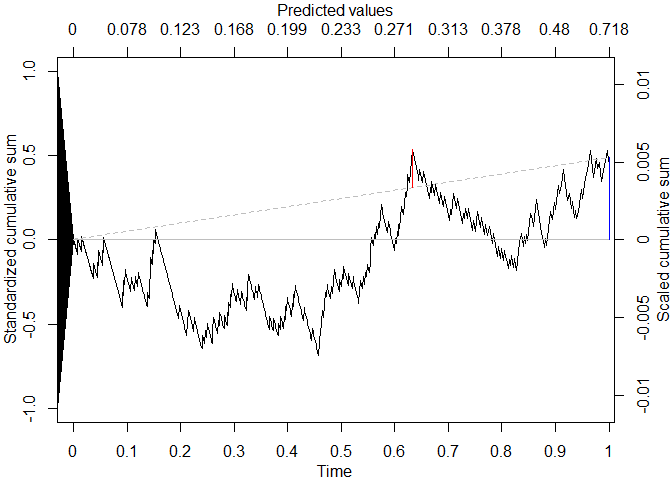

<!-- README.md is generated from README.Rmd. Please edit that file -->

# cumulcalib

<!-- badges: start -->

[](https://github.com/msadatsafavi/cumulcalib/actions/workflows/R-CMD-check.yaml)
<!-- badges: end -->

The goal of cumulcalib is to enable the use of the assessment of risk
prediction model calibration using the cumulative calibration
methodology.

## Installation

You can install the development version of cumulcalib from
[GitHub](https://github.com/) with:

``` r
# install.packages("devtools")
devtools::install_github("msadatsafavi/cumulcalib")
```

## Example

This is a basic example which shows you how to solve a common problem:

``` r
library(cumulcalib)

set.seed(1)
p <- rbeta(1000, 1,5)
y <- rbinom(1000,1,p)

res <- cumulcalib(y, p)

summary(res)
#> [1] "C_n (mean calibration error): 0.00532270104567871"
#> [1] "C* (maximum absolute cumulative calibration error): 0.00740996981029672"
#> [1] "Method: Two-part Brownian Bridge (BB)"
#> [1] "S_n (Z score for mean calibration error) 0.489295496431201"
#> [1] "B* (test statistic for maximum absolute bridged calibration error): 0.904915434767163"
#> [1] "Component-wise p-values:"
#>      mean  distance 
#> 0.6246325 0.3859797 
#> [1] "Combined value (Fisher'smethod): 0.584068794836004"
#> [1] "Location of maximum drift: 812  | time value: 0.632911942275094  | predictor value: 0.28191196504736"
plot(res, draw_sig=F)
```


